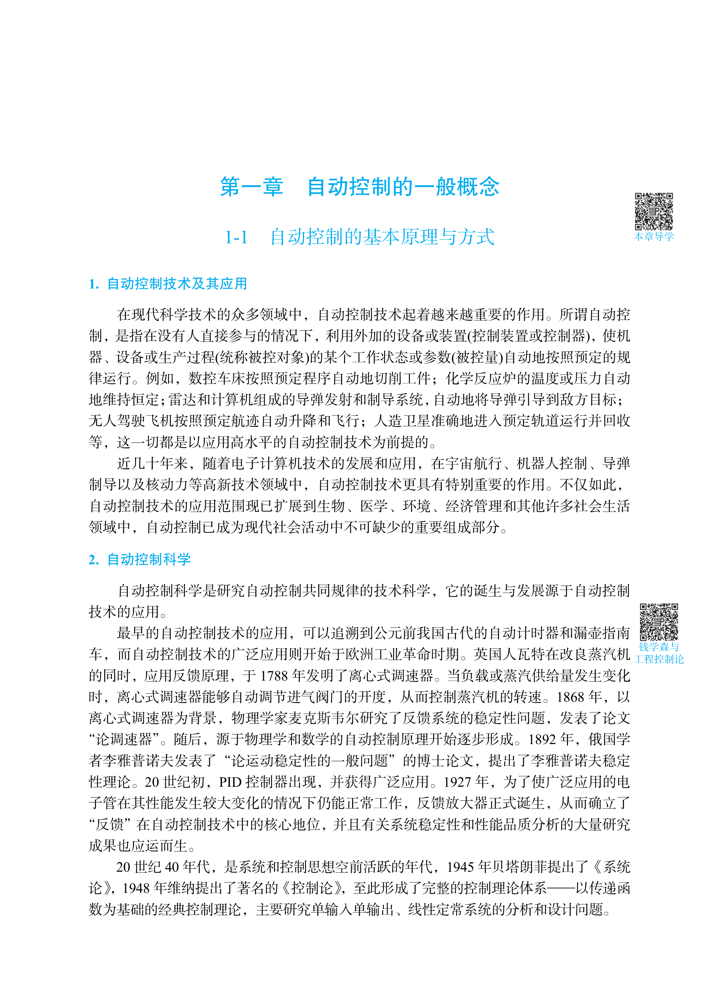
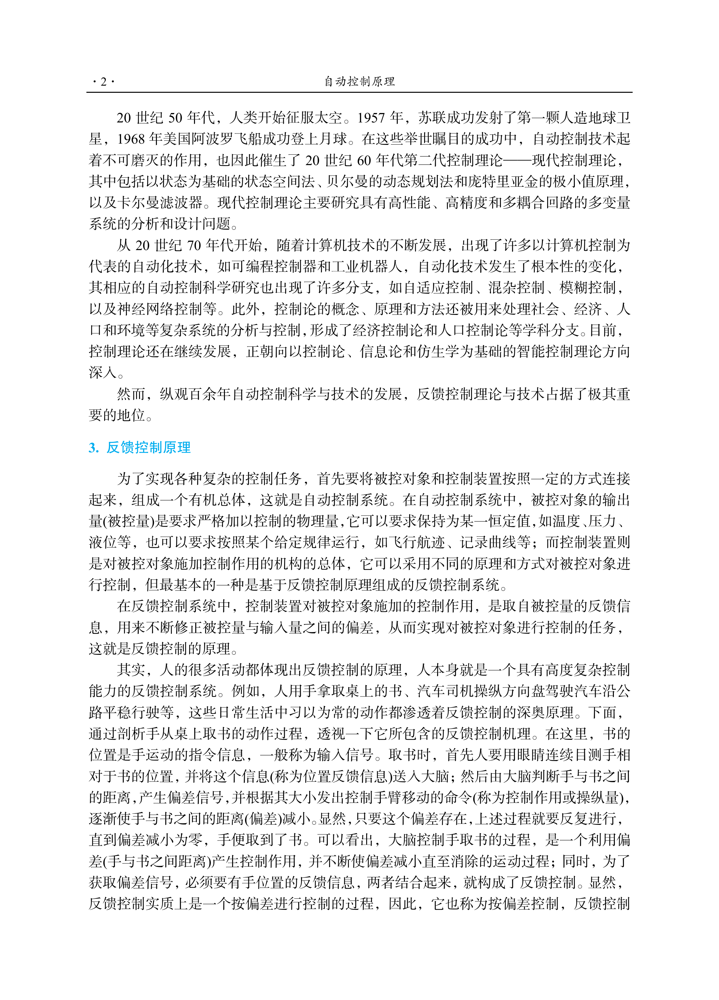
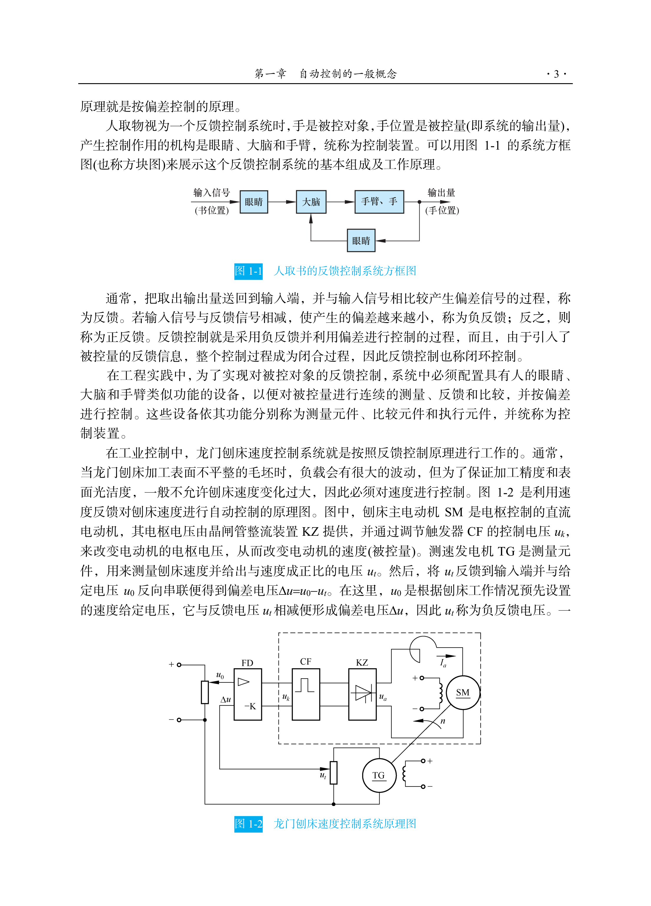
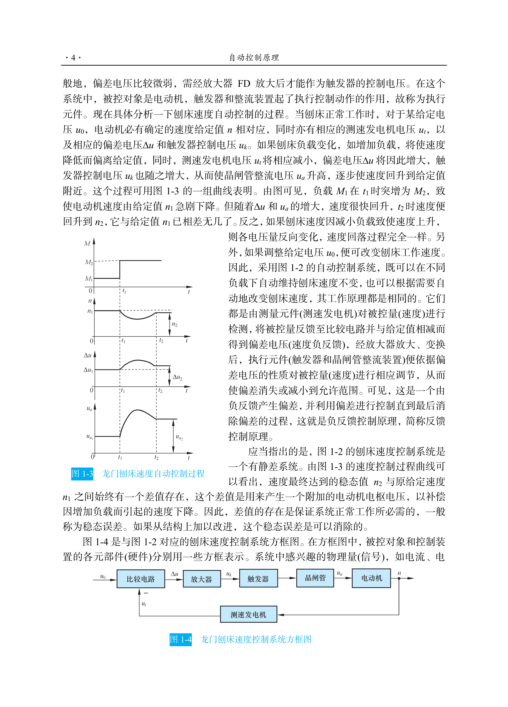
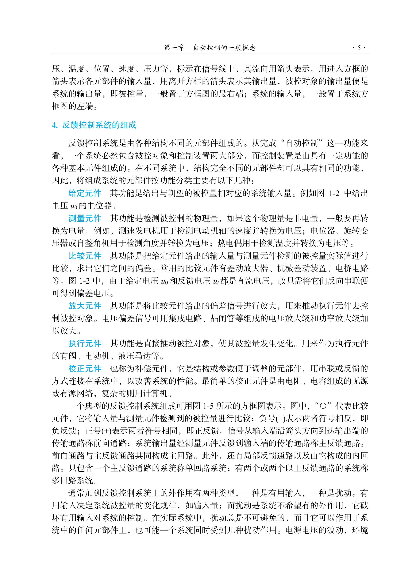
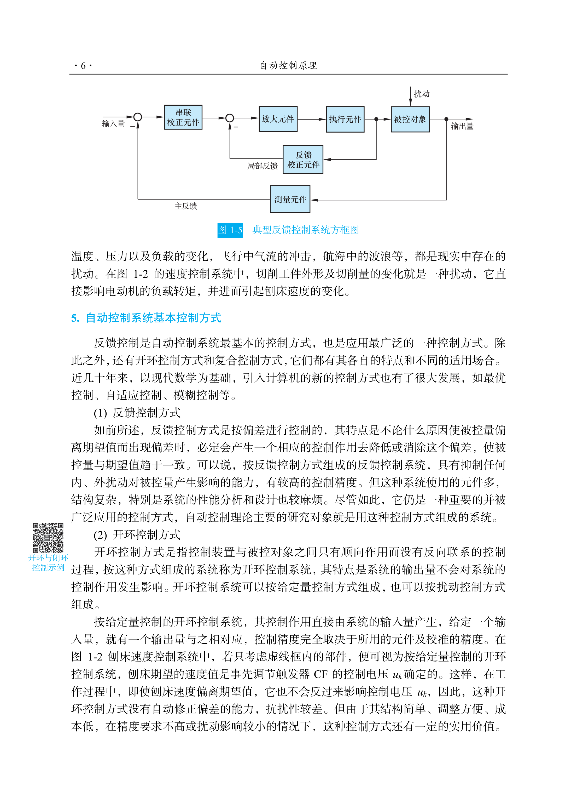
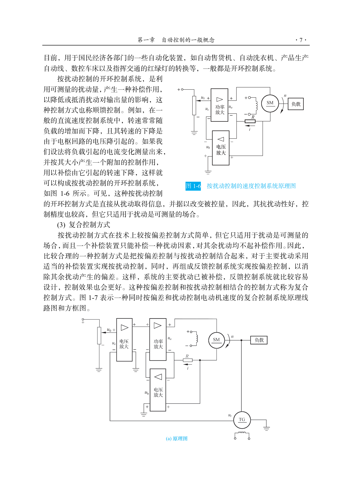

# 第一章 自动控制的一般概念

## 1-1 自动控制的基本原理与方式

### 一、自动控制的基本原理

自动控制（automatic control）是指在没有人直接参与的情况下，利用控制装置自动地操纵被控对象，使被控量（输出量）按照预定的规律运行和变化。其最基本的工作方式是在没有操作人员直接参与的情况下，采用控制装置自动地对被控对象进行操纵和控制，使之按预定的规律变化。

> 图1-1示意了人与书的反馈控制系统。一个人取书的过程，实际上包含了检测偏差、利用偏差和纠正偏差的反馈控制职能。

> **[图1-1 人取书的反馈控制系统方框图]**（图示为一个方框图，包含 脑（给定值），眼、手（控制器），书（被控对象），实际位置（输出）→ 反馈回眼 + 脑形成偏差）

**反馈控制系统的基本组成：**
- **测量元件** — 检测被控量（如人眼）
- **给定元件** — 给出期望值（如人脑中的目标位置）
- **比较元件** — 比较期望值与实际值得到偏差（如人脑计算偏差）
- **放大元件** — 放大偏差信号
- **执行元件** — 作用于被控对象（如人手）
- **校正元件** — 改善系统性能

> **[图1-2 自动控制系统的基本职能元件]**（图示为典型的反馈控制系统结构方框图）

**自动控制系统的基本控制方式：**
- **反馈控制方式** — 按偏差控制，是最基本的控制方式
- **开环控制方式** — 按给定值控制，无反馈
- **复合控制方式** — 开环+闭环结合

**反馈控制系统的基本定义：**
- **被控对象（plant）**：要求实现自动控制的机器、设备或生产过程
- **被控量（controlled variable）**：表征被控对象工作状态的物理参量
- **给定量（reference input/setpoint）**：希望被控量应具有的数值
- **扰动（disturbance）**：引起被控量偏离期望值的各种因素
- **反馈（feedback）**：将输出量送回到输入端与输入量比较的过程
- **负反馈（negative feedback）**：反馈信号与输入信号相减，使偏差减小

### 二、自动控制的基本方式

#### 1. 开环控制（open-loop control）

开环控制系统是指控制装置与被控对象之间只有顺向作用而无反向联系的控制系统。其特点是输出量不会对系统的控制作用产生影响，不具备抗扰动能力。

**开环控制的两种形式：**
1. **按给定值操纵** — 直接根据给定值进行控制（如步进电机控制系统）
2. **按扰动补偿** — 直接测量扰动并产生补偿作用（如前馈控制）

> **[图1-3 开环控制系统]**（图示为：给定值 → 控制器 → 被控对象 → 输出；无反馈回路）

#### 2. 反馈控制（feedback control）

反馈控制（闭环控制）是指控制装置与被控对象之间既有顺向作用又有反向联系的控制系统。利用负反馈原理，检测偏差、利用偏差、纠正偏差。

> **[图1-4 闭环控制系统]**（图示为：给定值 → 比较器 → 控制器 → 被控对象 → 输出，输出经测量元件反馈到比较器）

#### 3. 复合控制（compound control）

复合控制是将开环控制与闭环控制结合在一起的控制方式。既利用反馈控制抑制扰动，又利用开环控制提高响应速度。

> **[图1-5 复合控制系统]**（图示为开环与闭环相结合的复合控制结构）

## 1-2 自动控制系统示例

### 一、函数记录仪

**工作原理：**
函数记录仪是一种典型的反馈控制系统，其任务是精确地记录输入电压信号的变化。系统由伺服电动机、测速发电机、电位器等组成。

> **[图1-6 函数记录仪原理示意图]**（图示为函数记录仪的物理结构示意图，包含电位器、放大器、伺服电动机、测速发电机、减速器、纸带、笔架等）

**工作过程：** 输入电压信号与反馈电位器产生的电压比较 → 偏差电压经放大 → 驱动伺服电动机 → 带动记录笔移动 → 同时带动电位器电刷移动减小偏差 → 直至偏差为零

> **[图1-7 函数记录仪原理方框图]**（图示为：输入电压 → 比较 → 放大器 → 伺服电动机 → 减速器 → 记录笔 → 位移输出，测速发电机反馈，电位器反馈）

### 二、电阻炉温度控制系统

**工作原理：**
电阻炉温度控制系统通过控制加热元件的电流来维持炉温恒定。系统由热电偶、电压放大器、功率放大器、电动机、调压器等组成。

> **[图1-8 电阻炉温度控制系统原理图]**（图示为电阻炉的物理结构原理图，含热电偶、放大器、电动机、调压器、电阻丝等）

**工作过程：** 热电偶检测炉温 → 转换为电压 → 与给定电压比较 → 偏差经放大 → 驱动电动机 → 调节调压器 → 改变加热电流 → 使炉温趋于给定值

> **[图1-9 电阻炉温度控制系统方框图]**（图示为：给定电压 → 比较 → 放大器 → 电动机 → 调压器 → 电阻炉 → 炉温，热电偶反馈）

### 三、船舶液压舵机伺服系统

船舶舵机系统采用液压伺服控制，通过操纵舵叶角度来控制船舶航向。

> **[图1-10 船舶舵机伺服系统原理图]**（图示为：舵轮 → 杠杆 → 滑阀 → 液压缸 → 舵叶，含反馈连杆）

### 四、电液位置伺服系统

电液伺服系统常用于重型机械的位置控制，具有响应快、功率大的特点。

> **[图1-11 电液位置伺服系统]**（图示为电液伺服阀控制液压缸位置的系统原理图）

### 五、轴角随动系统

轴角随动系统用于远距离传输角位置信号，使从动轴跟随主动轴转动。

> **[图1-12 轴角随动系统原理图]**（图示为自整角机组成的角位置随动系统）

### 六、磁盘读入磁头浮动控制系统

磁盘驱动器中，磁头的浮动高度由气动控制系统精确调节，以保证读写可靠性。

> **[图1-13 磁盘磁头浮动控制系统]**（图示包含磁头浮动块、磁盘、气流通道等）

### 七、火炮跟踪系统

火炮跟踪系统用于自动跟踪空中目标，是典型的伺服系统。

> **[图1-14 火炮跟踪系统]**（图示为雷达天线跟踪目标的系统示意图）

### 八、机器人控制系统

机器人控制系统实现对机器人末端执行器位置和姿态的精确控制。

> **[图1-15 机器人控制系统原理图]**（图示包含控制器、伺服驱动器、机器人关节、传感器等）

### 九、无人机飞行控制系统

无人机飞控系统实现对飞行姿态、高度、航向的自动控制。

> **[图1-16 无人机飞行控制系统]**（图示包含飞控计算机、GPS、IMU、舵机等）

## 1-3 自动控制系统的分类

### 一、按输入信号特征分类

1. **恒值控制系统（自动调节系统）** — 输入量为恒定值，任务是克服扰动保持输出量恒定（如温度控制系统、稳压系统）
2. **随动系统（伺服系统）** — 输入量为未知变化的任意函数，任务是使输出量快速复现输入量（如雷达跟踪系统）
3. **程序控制系统** — 输入量按预定规律变化（如数控机床、程序控制机床）

### 二、按系统数学模型分类

1. **线性控制系统** — 可用线性微分方程或传递函数描述的系统（满足叠加原理）
2. **非线性控制系统** — 系统中含有非线性元件（如饱和、死区、间隙等）

### 三、按信号传递的连续性分类

1. **连续控制系统** — 系统中所有信号都是时间连续函数
2. **离散控制系统** — 系统中某处信号是脉冲序列或数字量

### 四、其他分类方式

- **单输入单输出（SISO）系统** 与 **多输入多输出（MIMO）系统**
- **定常系统** 与 **时变系统**
- **确定系统** 与 **不确定系统**

## 1-4 对自动控制系统的基本要求

自动控制系统的基本要求可归结为：**稳定性**、**快速性**、**准确性**（稳、快、准）。

### 一、稳定性（稳定性能）

**稳定性（stability）** 是系统正常工作的首要条件。稳定系统在受到扰动作用后，其输出响应最终应能回到原来的平衡状态或趋于新的平衡状态。

- **绝对稳定性**：判定系统是否稳定
- **相对稳定性**：稳定程度的度量

> **[图1-17 稳定与不稳定系统的响应曲线]**（图示为：稳定系统的衰减振荡曲线、不稳定系统的发散振荡曲线、临界稳定系统的等幅振荡曲线）

### 二、快速性（动态性能）

**快速性** 是指系统对输入信号响应的速度，反映系统跟踪输入信号或克服扰动的快慢程度。通常用以下指标衡量：

- **上升时间** $t_r$ — 响应从终值的10%上升到90%所需的时间
- **峰值时间** $t_p$ — 响应到达第一个峰值所需的时间
- **调节时间** $t_s$ — 响应进入并保持在允许误差范围所需的时间
- **超调量** $\sigma\%$ — 响应最大值与稳态值的相对偏差

### 三、准确性（稳态性能）

**准确性** 是指系统在稳态时的控制精度，用**稳态误差（steady-state error）** $e_{ss}$ 衡量。稳态误差越小，系统精度越高。

### 三者的关系

稳定性、快速性和准确性是相互制约的。通常情况下：
- 提高快速性会导致超调量增大，稳定性下降
- 提高稳定性会降低快速性
- 减小稳态误差可能导致动态性能变差

> **[图1-18 典型阶跃响应曲线]**（图示为二阶系统阶跃响应曲线，标注了 $t_r$、$t_p$、$t_s$、$\sigma\%$ 等）

## 1-5 自动控制系统的分析与设计工具

### 一、时域分析法

时域分析法是根据系统的微分方程，直接求解系统在典型输入信号作用下的时间响应，用响应曲线分析系统的稳定性、动态性能和稳态性能。

**典型输入信号：**
- **阶跃信号**：$r(t) = R \cdot 1(t)$，拉氏变换 $R(s) = R/s$
- **斜坡信号**：$r(t) = Rt \cdot 1(t)$，拉氏变换 $R(s) = R/s^2$
- **加速度信号**：$r(t) = \frac{1}{2}Rt^2 \cdot 1(t)$，拉氏变换 $R(s) = R/s^3$
- **脉冲信号**：$r(t) = R\delta(t)$，拉氏变换 $R(s) = R$
- **正弦信号**：$r(t) = R\sin\omega t$，拉氏变换 $R(s) = R\omega/(s^2+\omega^2)$

> **[图1-19 典型输入信号]**（图示为阶跃、斜坡、加速度、脉冲、正弦信号的波形）

### 二、根轨迹法

根轨迹法是在复域中分析系统性能的方法。通过绘制系统开环传递函数某参数变化时闭环特征根在 s 平面上移动的轨迹（根轨迹），来研究参数变化对系统性能的影响。

**特点：**
- 直观展示参数变化对系统稳定性和动态性能的影响
- 可以方便地确定系统的稳定裕度和满足性能要求的参数范围

> **[图1-20 典型根轨迹图]**（图示为二阶系统随开环增益 $K$ 变化的根轨迹）

### 三、频域分析法

频域分析法是通过研究系统对正弦输入信号的频率响应来分析系统性能的方法。

**主要内容：**
- **频率特性** $G(j\omega)$ — 系统对不同频率正弦信号的稳态响应特性
- **奈奎斯特稳定判据（Nyquist stability criterion）** — 利用开环频率特性判断闭环系统稳定性
- **稳定裕度** — 相角裕度 $\gamma$ 和幅值裕度 $h$（或 $K_g$）
- **系统带宽** $\omega_b$ — 反映系统的响应速度

> **[图1-21 频率特性曲线]**（图示为典型环节的幅频特性和相频特性曲线，及奈奎斯特图）

### 四、控制系统设计概述

**控制系统设计的一般步骤：**
1. **确定控制目标** — 明确系统应达到的性能指标
2. **建立数学模型** — 用微分方程、传递函数或状态空间模型描述系统
3. **系统分析** — 分析系统的稳定性、动态性能、稳态性能
4. **控制器设计** — 选择适当控制策略并设计控制器参数
5. **仿真验证** — 用计算机仿真验证设计效果
6. **工程实现** — 将控制器转化为实际硬件或软件

**常用校正方式：**
- **串联校正（series compensation）** — 校正装置串接在前向通道中
- **反馈校正（feedback compensation）** — 校正装置接在局部反馈回路中
- **前馈校正（feedforward compensation）** — 校正装置在给定值或扰动信号处
- **复合校正（compound compensation）** — 多种校正方式组合使用

---

## 习题

**1-1** 试列举几个日常生活中开环控制和闭环控制的例子，说明它们的工作原理和基本特点。

**1-2** 图1-22所示为仓库大门自动控制系统原理图。试说明系统的工作原理并画出系统方框图。

> **[图1-22 仓库大门自动控制系统]**（图示为仓库大门控制系统原理图，包含电动机、绞盘、门、位置检测器等）

**1-3** 图1-23所示为工业炉温自动控制系统原理图。试分析系统的工作原理，指出被控对象、被控量、给定量和扰动量，并画出系统方框图。

> **[图1-23 工业炉温自动控制系统]**（图示为工业电阻炉温度控制系统的原理图）

**1-4** 图1-24所示为水位自动控制系统原理图。试说明系统的工作原理，并指出系统的被控对象、被控量、给定量和扰动量，画出系统方框图。

> **[图1-24 水位自动控制系统]**（图示为水箱水位控制系统原理图）

**1-5** 图1-25所示为发动机转速自动控制系统原理图。试分析系统的工作原理，并画出系统方框图。

> **[图1-25 发动机转速自动控制系统]**（图示为发动机转速控制系统的原理图）

**1-6** 试说明反馈控制系统的基本元件及其在系统中的作用。

**1-7** 什么是开环控制？什么是闭环控制（反馈控制）？两者各有什么优缺点？适用于什么场合？

**1-8** 对自动控制系统的基本要求是什么？什么是"稳、快、准"？

**1-9** 试从稳定性、快速性和准确性三个方面，分析某一实际控制系统（如空调系统、热水器系统等）的性能特点。

**1-10** 什么是数学模型？控制系统有哪些常用的数学描述方法？

---

> **本章小结**
>
> 本章介绍了自动控制的基本概念、基本原理和基本方式。重点掌握：
> 1. 反馈控制（闭环控制）的基本原理和工作方式
> 2. 自动控制系统的组成与分类
> 3. 对控制系统"稳、快、准"的基本要求
> 4. 控制系统分析与设计的各类工具方法

---

*本章对应教材页码：第1~24页 | 图片编号：图1-1 ~ 图1-25*
